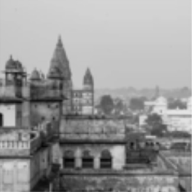
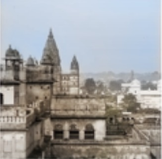
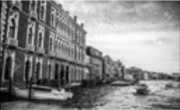
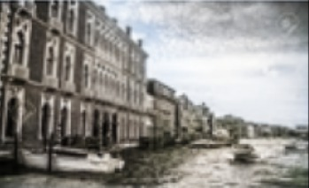

# 🖼️ Image Deoldification using Deep Learning

This project aims to build a functional **image deoldifier** — a model that converts old or degraded images into vivid, colorized versions. Inspired by the [DeOldify](https://github.com/jantic/DeOldify) repository, this implementation uses a CNN-based model trained on synthetic "old" images to perform deoldification, including **colorization**, **noise reduction**, and **clarity enhancement**.

## 🔍 Overview

Given grayscale or aged-looking images, this model restores them to a more modern, colorful version. It simulates old photographs by applying augmentations to clean images and then trains a model to reverse this process.

## 🧠 Model Architecture

- **U-Net** based convolutional neural network for image-to-image translation.
- Trained with:
  - **MSE Loss** between predicted and ground truth images.
  - **PSNR** and **SSIM** used for performance monitoring.

## 🗂️ Dataset

We used the **Google Landmarks Monuments Dataset** and synthetically aged the images by applying:

- `grayscale`
- `random_noise`
- `gaussian_blur`
- `multiplicative_noise`

This allowed us to create pairs of `(old_image, clean_image)` to train the model in a supervised fashion.

## 🏗️ Project Structure

```
.
├── deoldifytrain.ipynb   # Main training and inference notebook
├── README.md             # Project readme
└── results/              # Sample outputs (optional)
```

## 🚀 Getting Started

### 1. Clone the repository

```bash
git clone https://github.com/yourusername/image-deoldification.git
cd image-deoldification
```

### 2. Install dependencies

Recommended: Use a virtual environment.

```bash
pip install -r requirements.txt
```

You may need:

- `tensorflow` or `torch` (depending on your implementation)
- `opencv-python`
- `matplotlib`
- `scikit-image`
- `numpy`

### 3. Run the notebook

Open `deoldifytrain.ipynb` and run all cells to train or infer on test images.

## 🖼️ Results

Here are some before and after samples:

| Old Image | Deoldified Output |
|-----------|--------------------|
|  |  |
|  |  |

## 📈 Performance

- Achieved good perceptual colorization and noise removal.
- Qualitative improvements observed visually.
- Further enhancement possible using perceptual loss or GAN-based training.

## 🧪 Future Work

- Add a discriminator to implement GAN training.
- Fine-tune using historical photo datasets.
- Deploy as a web app using Gradio or Streamlit.

## 🤝 Acknowledgements

Inspired by [DeOldify](https://github.com/jantic/DeOldify). Dataset by Google Landmarks.
